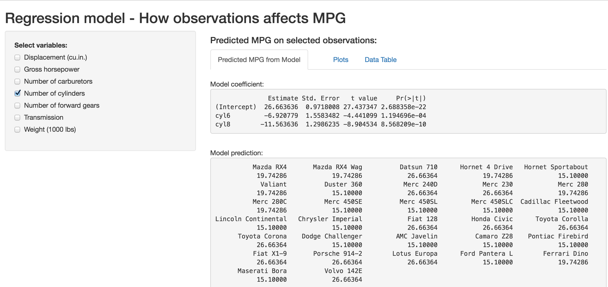
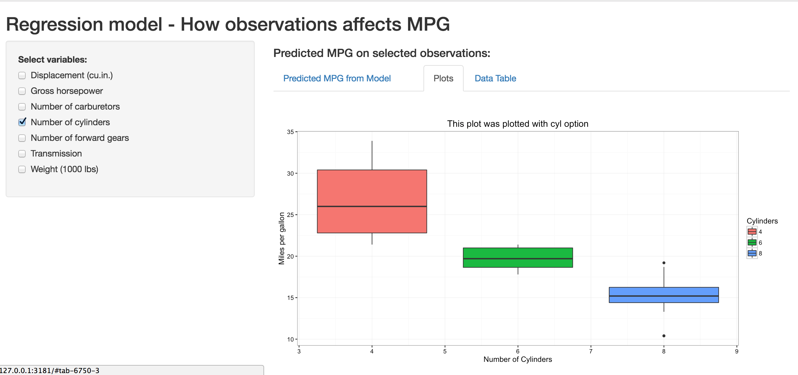

## Project background
This is a reactive shiny application using shiny package and mtcars data to interact with user selections to see how data used to explore data with plots and predictions. We are deploying the application using RStudio server.

There are two files for the applicaiton:

* ui.R : UI file
* server.R : Server file

There are some data manipulation to the mtcars for regression model. However, mtcars data is intact. Necessary changes are done in a copy of the mtcars data. 

You will need to following packages to run the application:

* shiny, ggplot2, caret and rpart

## What to do with the application

* The application contains a left side bar which you can select different observations (variables).
* User can select one or more observations on the left side panel and see informations on the right panel. 
* The right panel contains 3 tabs. 
* First tab is to look at differnt observations with linear regression model, what is the coefficient and predictions base on selected variables. 
* Second tab shows the plots for MPG vs selected variables. This is for data exploration and see what variable has effects on MPG. Scroll down for more plots if more variales are selected.
* Third tab show the data table with selected obserations.

## Screenshot - Model

## Screenshot -  Plots

